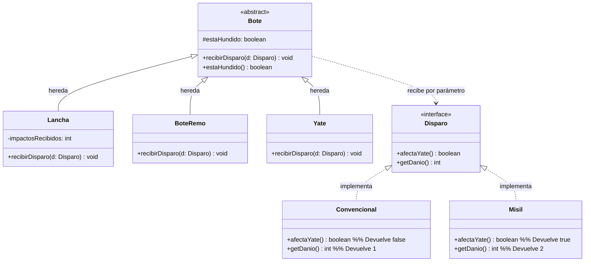

```mermaid
classDiagram
    class Bote {
        <<abstract>>
        #estaHundido: boolean
        +recibirDisparo(d: Disparo) void
        +estaHundido() boolean
    }
    
    class Lancha {
        -impactosRecibidos: int
        +recibirDisparo(d: Disparo) void
    }
    
    class BoteRemo {
        +recibirDisparo(d: Disparo) void
    }
    
    class Yate {
        +recibirDisparo(d: Disparo) void
    }
    
    class Disparo {
        <<interface>>
        +afectaYate() boolean
        +getDanio() int
    }
    
    class Convencional {
        +afectaYate() boolean %% Devuelve false
        +getDanio() int %% Devuelve 1
    }
    
    class Misil {
        +afectaYate() boolean %% Devuelve true
        +getDanio() int %% Devuelve 2
    }

    %% Relaciones
    Bote <|-- Lancha : hereda
    Bote <|-- BoteRemo : hereda
    Bote <|-- Yate : hereda
    
    Disparo <|.. Convencional : implementa
    Disparo <|.. Misil : implementa
    
    Bote ..> Disparo : recibe por parámetro
```