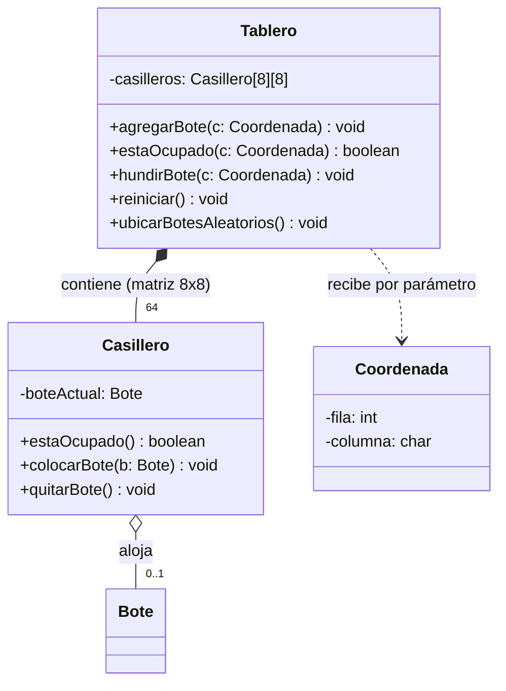

```mermaid
classDiagram
    class Tablero {
        -casilleros: Casillero[8][8]
        +agregarBote(c: Coordenada) void
        +estaOcupado(c: Coordenada) boolean
        +hundirBote(c: Coordenada) void
        +reiniciar() void
        +ubicarBotesAleatorios() void
    }

    class Casillero {
        -boteActual: Bote
        +estaOcupado() boolean
        +colocarBote(b: Bote) void
        +quitarBote() void
    }

    class Bote {
        %% Por ahora vacío, ocupa 1 solo casillero
    }

    class Coordenada {
        -fila: int
        -columna: char
    }

    %% Relaciones
    Tablero *-- "64" Casillero : contiene (matriz 8x8)
    Tablero ..> Coordenada : recibe por parámetro
    Casillero o-- "0..1" Bote : aloja
```