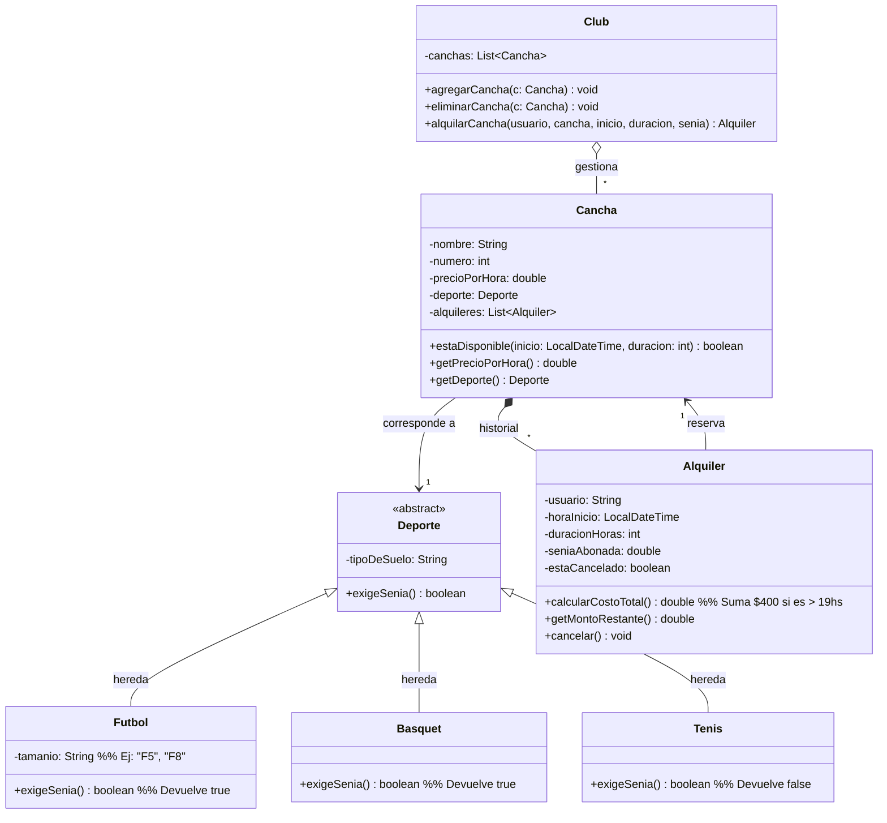

```mermaid
classDiagram
    class Club {
        -canchas: List~Cancha~
        +agregarCancha(c: Cancha) void
        +eliminarCancha(c: Cancha) void
        +alquilarCancha(usuario, cancha, inicio, duracion, senia) Alquiler
    }

    class Cancha {
        -nombre: String
        -numero: int
        -precioPorHora: double
        -deporte: Deporte
        -alquileres: List~Alquiler~
        +estaDisponible(inicio: LocalDateTime, duracion: int) boolean
        +getPrecioPorHora() double
        +getDeporte() Deporte
    }

    class Deporte {
        <<abstract>>
        -tipoDeSuelo: String
        +exigeSenia() boolean
    }

    class Futbol {
        -tamanio: String %% Ej: "F5", "F8"
        +exigeSenia() boolean %% Devuelve true
    }

    class Basquet {
        +exigeSenia() boolean %% Devuelve true
    }

    class Tenis {
        +exigeSenia() boolean %% Devuelve false
    }

    class Alquiler {
        -usuario: String
        -horaInicio: LocalDateTime
        -duracionHoras: int
        -seniaAbonada: double
        -estaCancelado: boolean
        +calcularCostoTotal() double %% Suma $400 si es > 19hs
        +getMontoRestante() double
        +cancelar() void
    }

    %% Relaciones
    Club o-- "*" Cancha : gestiona
    Cancha *-- "*" Alquiler : historial
    Alquiler --> "1" Cancha : reserva
    Cancha --> "1" Deporte : corresponde a
    
    Deporte <|-- Futbol : hereda
    Deporte <|-- Basquet : hereda
    Deporte <|-- Tenis : hereda
```