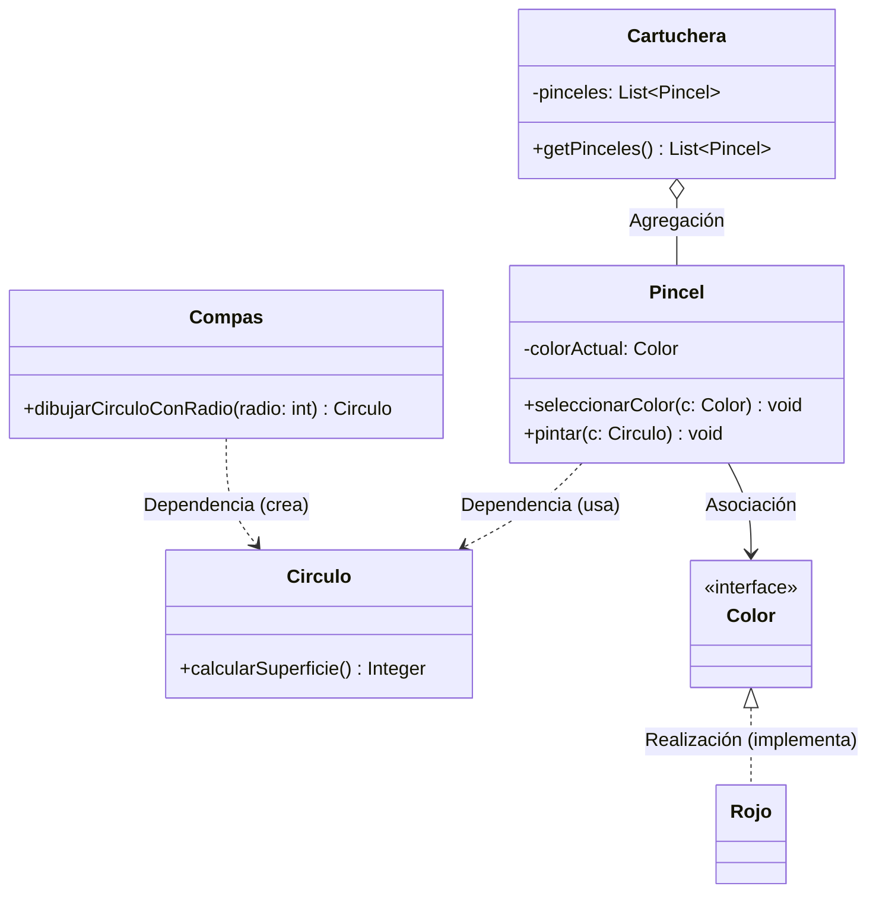

```mermaid
classDiagram
    class Compas {
        +dibujarCirculoConRadio(radio: int) Circulo
    }
    
    class Circulo {
        +calcularSuperficie() Integer
    }
    
    class Cartuchera {
        -pinceles: List~Pincel~
        +getPinceles() List~Pincel~
    }
    
    class Pincel {
        -colorActual: Color
        +seleccionarColor(c: Color) void
        +pintar(c: Circulo) void
    }
    
    class Color {
        <<interface>>
    }
    
    class Rojo {
    }

    %% Relaciones
    Cartuchera o-- Pincel : Agregación
    Compas ..> Circulo : Dependencia (crea)
    Color <|.. Rojo : Realización (implementa)
    Pincel --> Color : Asociación
    Pincel ..> Circulo : Dependencia (usa)
```