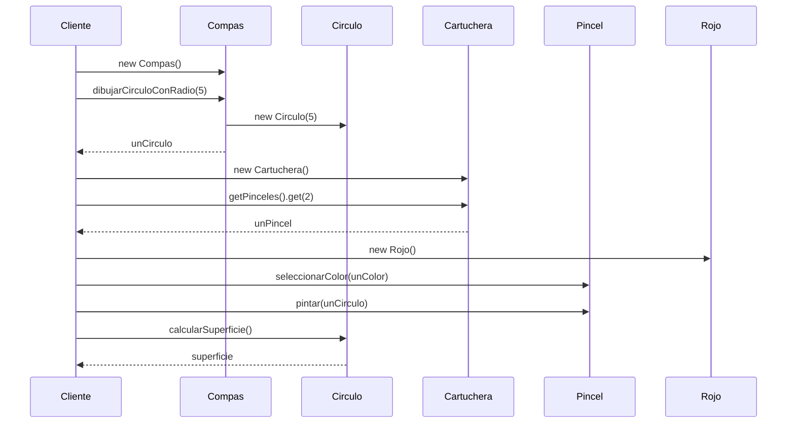

```mermaid
sequenceDiagram
    participant Main as Cliente
    participant Comp as Compas
    participant Circ as Circulo
    participant Cart as Cartuchera
    participant Pinc as Pincel
    participant Col as Rojo

    Main->>Comp: new Compas()
    Main->>Comp: dibujarCirculoConRadio(5)
    Comp->>Circ: new Circulo(5)
    Comp-->>Main: unCirculo
    
    Main->>Cart: new Cartuchera()
    Main->>Cart: getPinceles().get(2)
    Cart-->>Main: unPincel
    
    Main->>Col: new Rojo()
    Main->>Pinc: seleccionarColor(unColor)
    Main->>Pinc: pintar(unCirculo)
    
    Main->>Circ: calcularSuperficie()
    Circ-->>Main: superficie
```