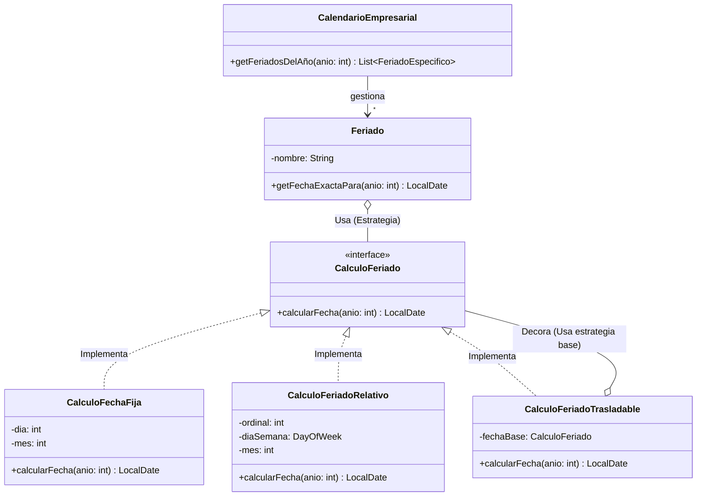

```mermaid
classDiagram
    class CalendarioEmpresarial {
        +getFeriadosDelAño(anio: int) List~FeriadoEspecifico~
    }
    
    class Feriado {
        -nombre: String
        +getFechaExactaPara(anio: int) LocalDate
    }
    
    class CalculoFeriado {
        <<interface>>
        +calcularFecha(anio: int) LocalDate
    }
    
    class CalculoFechaFija {
        -dia: int
        -mes: int
        +calcularFecha(anio: int) LocalDate
    }
    
    class CalculoFeriadoRelativo {
        -ordinal: int
        -diaSemana: DayOfWeek
        -mes: int
        +calcularFecha(anio: int) LocalDate
    }
    
    class CalculoFeriadoTrasladable {
        -fechaBase: CalculoFeriado
        +calcularFecha(anio: int) LocalDate
    }

    %% Relaciones
    CalendarioEmpresarial --> "*" Feriado : gestiona
    Feriado o-- CalculoFeriado : Usa (Estrategia)
    CalculoFeriado <|.. CalculoFechaFija : Implementa
    CalculoFeriado <|.. CalculoFeriadoRelativo : Implementa
    CalculoFeriado <|.. CalculoFeriadoTrasladable : Implementa
    CalculoFeriadoTrasladable o-- CalculoFeriado : Decora (Usa estrategia base)
```