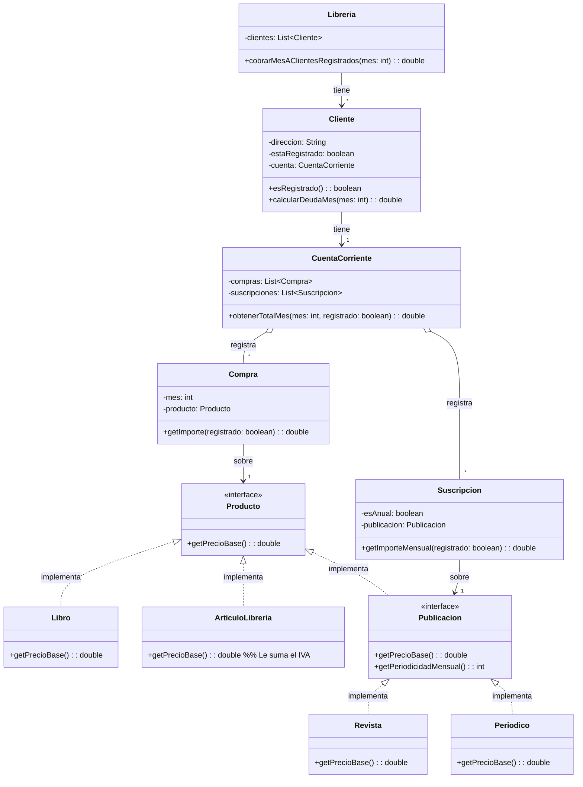

```mermaid
classDiagram
    class Libreria {
        -clientes: List~Cliente~
        +cobrarMesAClientesRegistrados(mes: int): double
    }
    
    class Cliente {
        -direccion: String
        -estaRegistrado: boolean
        -cuenta: CuentaCorriente
        +esRegistrado(): boolean
        +calcularDeudaMes(mes: int): double
    }
    
    class CuentaCorriente {
        -compras: List~Compra~
        -suscripciones: List~Suscripcion~
        +obtenerTotalMes(mes: int, registrado: boolean): double
    }
    
    class Compra {
        -mes: int
        -producto: Producto
        +getImporte(registrado: boolean): double
    }
    
    class Suscripcion {
        -esAnual: boolean
        -publicacion: Publicacion
        +getImporteMensual(registrado: boolean): double
    }
    
    class Producto {
        <<interface>>
        +getPrecioBase(): double
    }
    
    class Libro {
        +getPrecioBase(): double
    }
    
    class ArticuloLibreria {
        +getPrecioBase(): double %% Le suma el IVA
    }
    
    class Publicacion {
        <<interface>>
        +getPrecioBase(): double
        +getPeriodicidadMensual(): int
    }
    
    class Revista {
        +getPrecioBase(): double
    }
    
    class Periodico {
        +getPrecioBase(): double
    }

    %% Relaciones
    Libreria --> "*" Cliente : tiene
    Cliente --> "1" CuentaCorriente : tiene
    CuentaCorriente o-- "*" Compra : registra
    CuentaCorriente o-- "*" Suscripcion : registra
    Compra --> "1" Producto : sobre
    Suscripcion --> "1" Publicacion : sobre
    
    Producto <|.. Libro : implementa
    Producto <|.. ArticuloLibreria : implementa
    Producto <|.. Publicacion : implementa
    Publicacion <|.. Revista : implementa
    Publicacion <|.. Periodico : implementa
```