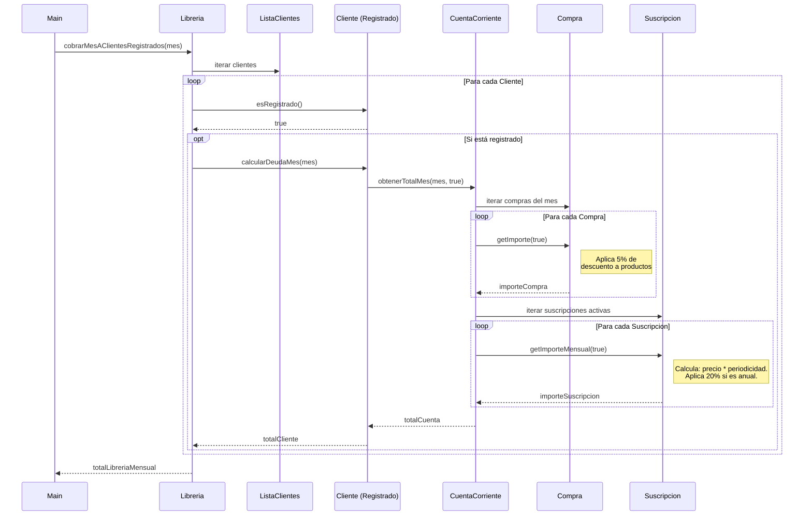

```mermaid
sequenceDiagram
    participant Main
    participant Lib as Libreria
    participant ListaC as ListaClientes
    participant Cli as Cliente (Registrado)
    participant Cta as CuentaCorriente
    participant Comp as Compra
    participant Susc as Suscripcion

    Main->>Lib: cobrarMesAClientesRegistrados(mes)
    Lib->>ListaC: iterar clientes
    
    loop Para cada Cliente
        Lib->>Cli: esRegistrado()
        Cli-->>Lib: true
        
        opt Si está registrado
            Lib->>Cli: calcularDeudaMes(mes)
            Cli->>Cta: obtenerTotalMes(mes, true)
            
            %% Calcula compras del mes
            Cta->>Comp: iterar compras del mes
            loop Para cada Compra
                Cta->>Comp: getImporte(true)
                Note right of Comp: Aplica 5% de<br/>descuento a productos
                Comp-->>Cta: importeCompra
            end
            
            %% Calcula suscripciones
            Cta->>Susc: iterar suscripciones activas
            loop Para cada Suscripcion
                Cta->>Susc: getImporteMensual(true)
                Note right of Susc: Calcula: precio * periodicidad.<br/>Aplica 20% si es anual.
                Susc-->>Cta: importeSuscripcion
            end
            
            Cta-->>Cli: totalCuenta
            Cli-->>Lib: totalCliente
        end
    end
    
    Lib-->>Main: totalLibreriaMensual
```