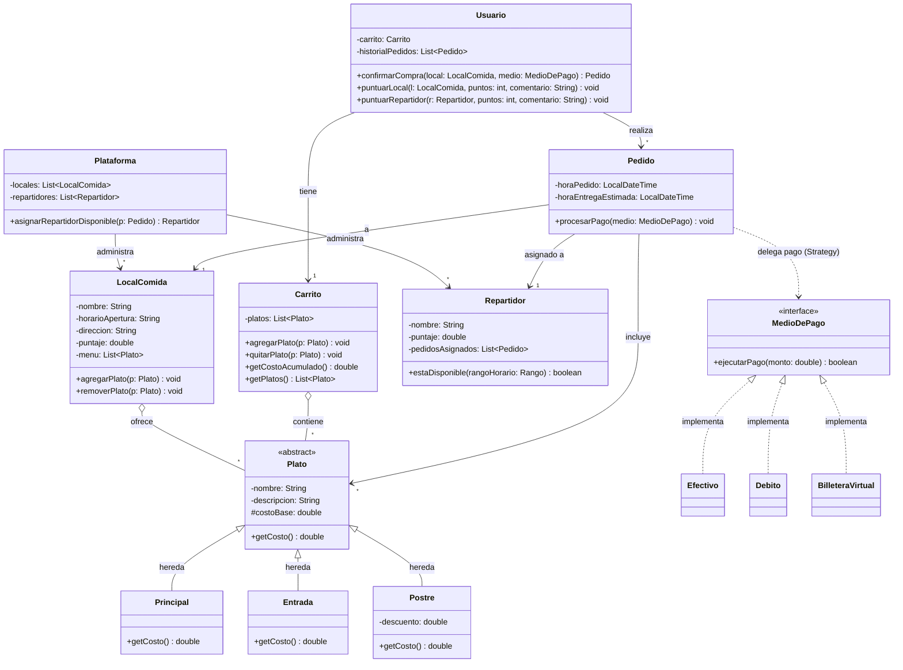

```mermaid
classDiagram
    class Plataforma {
        -locales: List~LocalComida~
        -repartidores: List~Repartidor~
        +asignarRepartidorDisponible(p: Pedido) Repartidor
    }

    class LocalComida {
        -nombre: String
        -horarioApertura: String
        -direccion: String
        -puntaje: double
        -menu: List~Plato~
        +agregarPlato(p: Plato) void
        +removerPlato(p: Plato) void
    }

    class Plato {
        <<abstract>>
        -nombre: String
        -descripcion: String
        #costoBase: double
        +getCosto() double
    }

    class Principal {
        +getCosto() double
    }
    
    class Entrada {
        +getCosto() double
    }
    
    class Postre {
        -descuento: double
        +getCosto() double
    }

    class Usuario {
        -carrito: Carrito
        -historialPedidos: List~Pedido~
        +confirmarCompra(local: LocalComida, medio: MedioDePago) Pedido
        +puntuarLocal(l: LocalComida, puntos: int, comentario: String) void
        +puntuarRepartidor(r: Repartidor, puntos: int, comentario: String) void
    }

    class Carrito {
        -platos: List~Plato~
        +agregarPlato(p: Plato) void
        +quitarPlato(p: Plato) void
        +getCostoAcumulado() double
        +getPlatos() List~Plato~
    }

    class Pedido {
        -horaPedido: LocalDateTime
        -horaEntregaEstimada: LocalDateTime
        +procesarPago(medio: MedioDePago) void
    }

    class Repartidor {
        -nombre: String
        -puntaje: double
        -pedidosAsignados: List~Pedido~
        +estaDisponible(rangoHorario: Rango) boolean
    }

    class MedioDePago {
        <<interface>>
        +ejecutarPago(monto: double) boolean
    }

    class Efectivo
    class Debito
    class BilleteraVirtual

    %% Relaciones
    Plataforma --> "*" LocalComida : administra
    Plataforma --> "*" Repartidor : administra
    LocalComida o-- "*" Plato : ofrece
    
    Plato <|-- Principal : hereda
    Plato <|-- Entrada : hereda
    Plato <|-- Postre : hereda
    
    Usuario --> "1" Carrito : tiene
    Carrito o-- "*" Plato : contiene
    
    Usuario --> "*" Pedido : realiza
    Pedido --> "1" LocalComida : a
    Pedido --> "*" Plato : incluye
    Pedido --> "1" Repartidor : asignado a
    
    Pedido ..> MedioDePago : delega pago (Strategy)
    MedioDePago <|.. Efectivo : implementa
    MedioDePago <|.. Debito : implementa
    MedioDePago <|.. BilleteraVirtual : implementa
```