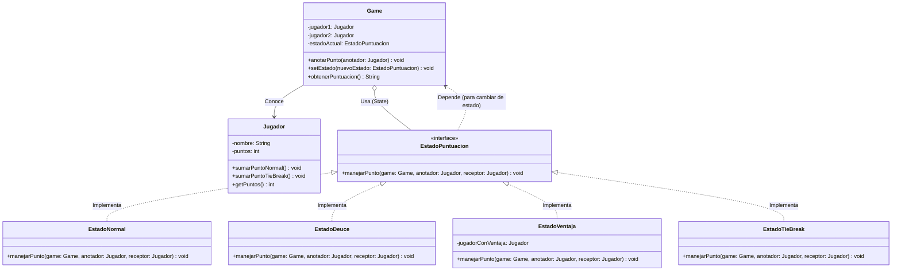

```mermaid
classDiagram
    class Game {
        -jugador1: Jugador
        -jugador2: Jugador
        -estadoActual: EstadoPuntuacion
        +anotarPunto(anotador: Jugador) void
        +setEstado(nuevoEstado: EstadoPuntuacion) void
        +obtenerPuntuacion() String
    }
    
    class Jugador {
        -nombre: String
        -puntos: int
        +sumarPuntoNormal() void
        +sumarPuntoTieBreak() void
        +getPuntos() int
    }
    
    class EstadoPuntuacion {
        <<interface>>
        +manejarPunto(game: Game, anotador: Jugador, receptor: Jugador) void
    }
    
    class EstadoNormal {
        +manejarPunto(game: Game, anotador: Jugador, receptor: Jugador) void
    }
    
    class EstadoDeuce {
        +manejarPunto(game: Game, anotador: Jugador, receptor: Jugador) void
    }
    
    class EstadoVentaja {
        -jugadorConVentaja: Jugador
        +manejarPunto(game: Game, anotador: Jugador, receptor: Jugador) void
    }
    
    class EstadoTieBreak {
        +manejarPunto(game: Game, anotador: Jugador, receptor: Jugador) void
    }

    %% Relaciones
    Game o-- EstadoPuntuacion : Usa (State)
    Game --> Jugador : Conoce
    EstadoPuntuacion <|.. EstadoNormal : Implementa
    EstadoPuntuacion <|.. EstadoDeuce : Implementa
    EstadoPuntuacion <|.. EstadoVentaja : Implementa
    EstadoPuntuacion <|.. EstadoTieBreak : Implementa
    EstadoPuntuacion ..> Game : Depende (para cambiar de estado)
```