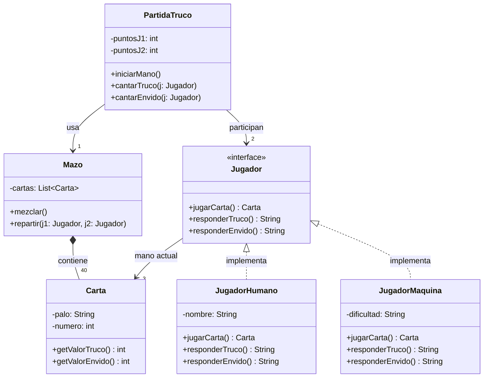

```mermaid
classDiagram
    class PartidaTruco {
        -puntosJ1: int
        -puntosJ2: int
        +iniciarMano()
        +cantarTruco(j: Jugador)
        +cantarEnvido(j: Jugador)
    }

    class Mazo {
        -cartas: List~Carta~
        +mezclar()
        +repartir(j1: Jugador, j2: Jugador)
    }

    class Carta {
        -palo: String
        -numero: int
        +getValorTruco() int
        +getValorEnvido() int
    }

    class Jugador {
        <<interface>>
        +jugarCarta() Carta
        +responderTruco() String
        +responderEnvido() String
    }

    class JugadorHumano {
        -nombre: String
        +jugarCarta() Carta
        +responderTruco() String
        +responderEnvido() String
    }

    class JugadorMaquina {
        -dificultad: String
        +jugarCarta() Carta
        +responderTruco() String
        +responderEnvido() String
    }

    %% Relaciones
    PartidaTruco --> "1" Mazo : usa
    PartidaTruco --> "2" Jugador : participan
    Mazo *-- "40" Carta : contiene
    Jugador <|.. JugadorHumano : implementa
    Jugador <|.. JugadorMaquina : implementa
    Jugador --> "3" Carta : mano actual
```