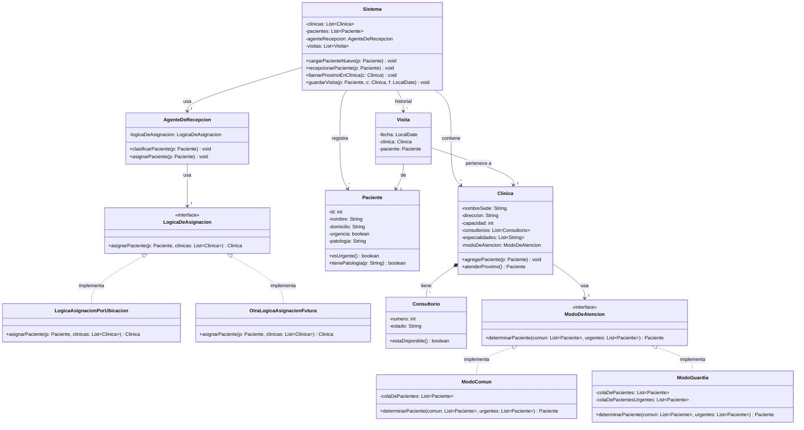

```mermaid
classDiagram
    class Sistema {
        -clinicas: List~Clinica~
        -pacientes: List~Paciente~
        -agenteRecepcion: AgenteDeRecepcion
        -visitas: List~Visita~
        +cargarPacienteNuevo(p: Paciente) void
        +recepcionarPaciente(p: Paciente) void
        +llamarProximoEnClinica(c: Clinica) void
        +guardarVisita(p: Paciente, c: Clinica, f: LocalDate) void
    }

    class AgenteDeRecepcion {
        -logicaDeAsignacion: LogicaDeAsignacion
        +clasificarPaciente(p: Paciente) void
        +asignarPaciente(p: Paciente) void
    }

    class LogicaDeAsignacion {
        <<interface>>
        +asignarPaciente(p: Paciente, clinicas: List~Clinica~) Clinica
    }

    class LogicaAsignacionPorUbicacion {
        +asignarPaciente(p: Paciente, clinicas: List~Clinica~) Clinica
    }

    class OtraLogicaAsignacionFutura {
        +asignarPaciente(p: Paciente, clinicas: List~Clinica~) Clinica
    }

    class Paciente {
        -id: int
        -nombre: String
        -domicilio: String
        -urgencia: boolean
        -patologia: String
        +esUrgente() boolean
        +tienePatologia(p: String) boolean
    }

    class Clinica {
        -nombreSede: String
        -direccion: String
        -capacidad: int
        -consultorios: List~Consultorio~
        -especialidades: List~String~
        -modoDeAtencion: ModoDeAtencion
        +agregarPaciente(p: Paciente) void
        +atenderProximo() Paciente
    }

    class Consultorio {
        -numero: int
        -estado: String
        +estaDisponible() boolean
    }

    class ModoDeAtencion {
        <<interface>>
        +determinarPaciente(comun: List~Paciente~, urgentes: List~Paciente~) Paciente
    }

    class ModoComun {
        -colaDePacientes: List~Paciente~
        +determinarPaciente(comun: List~Paciente~, urgentes: List~Paciente~) Paciente
    }

    class ModoGuardia {
        -colaDePacientes: List~Paciente~
        -colaDePacientesUrgentes: List~Paciente~
        +determinarPaciente(comun: List~Paciente~, urgentes: List~Paciente~) Paciente
    }

    class Visita {
        -fecha: LocalDate
        -clinica: Clinica
        -paciente: Paciente
    }

    %% Relaciones
    Sistema --> "*" Clinica : contiene
    Sistema --> "*" Paciente : registra
    Sistema --> "1" AgenteDeRecepcion : usa
    Sistema --> "*" Visita : historial
    
    AgenteDeRecepcion --> "1" LogicaDeAsignacion : usa
    LogicaDeAsignacion <|.. LogicaAsignacionPorUbicacion : implementa
    LogicaDeAsignacion <|.. OtraLogicaAsignacionFutura : implementa
    
    Clinica --> "1" ModoDeAtencion : usa
    ModoDeAtencion <|.. ModoComun : implementa
    ModoDeAtencion <|.. ModoGuardia : implementa
    Clinica *-- "*" Consultorio : tiene
    
    Visita --> "1" Clinica : pertenece a
    Visita --> "1" Paciente : de
```