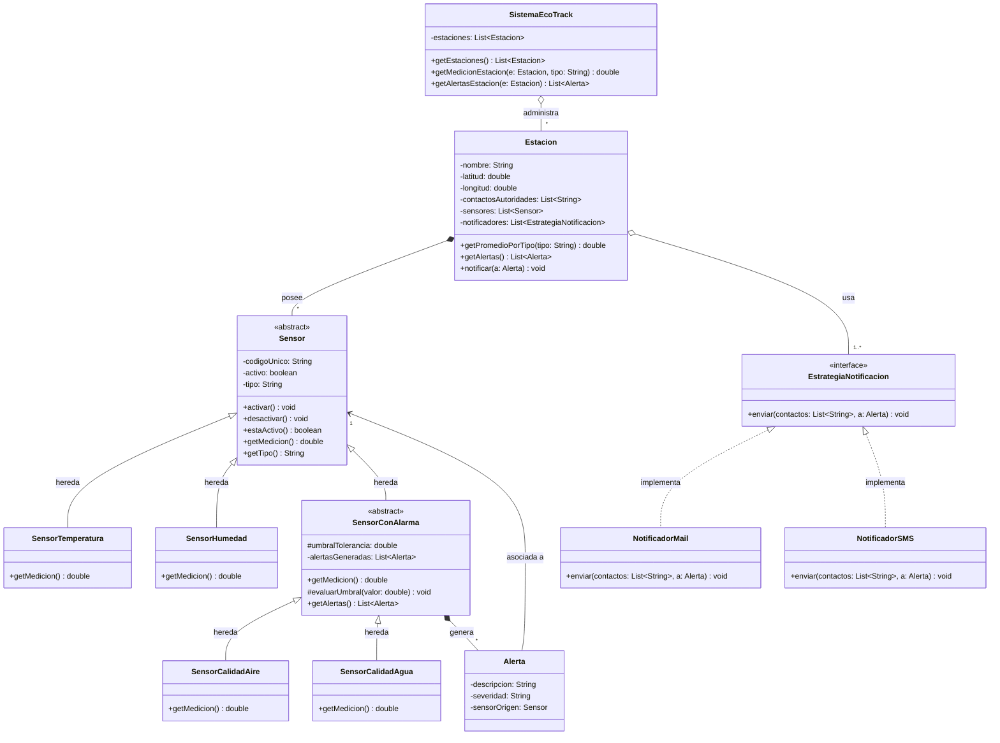

```mermaid
classDiagram
    class SistemaEcoTrack {
        -estaciones: List~Estacion~
        +getEstaciones() List~Estacion~
        +getMedicionEstacion(e: Estacion, tipo: String) double
        +getAlertasEstacion(e: Estacion) List~Alerta~
    }

    class Estacion {
        -nombre: String
        -latitud: double
        -longitud: double
        -contactosAutoridades: List~String~
        -sensores: List~Sensor~
        -notificadores: List~EstrategiaNotificacion~
        +getPromedioPorTipo(tipo: String) double
        +getAlertas() List~Alerta~
        +notificar(a: Alerta) void
    }

    class Sensor {
        <<abstract>>
        -codigoUnico: String
        -activo: boolean
        -tipo: String
        +activar() void
        +desactivar() void
        +estaActivo() boolean
        +getMedicion() double
        +getTipo() String
    }

    class SensorTemperatura {
        +getMedicion() double
    }

    class SensorHumedad {
        +getMedicion() double
    }

    class SensorConAlarma {
        <<abstract>>
        #umbralTolerancia: double
        -alertasGeneradas: List~Alerta~
        +getMedicion() double
        #evaluarUmbral(valor: double) void
        +getAlertas() List~Alerta~
    }

    class SensorCalidadAire {
        +getMedicion() double
    }

    class SensorCalidadAgua {
        +getMedicion() double
    }

    class Alerta {
        -descripcion: String
        -severidad: String
        -sensorOrigen: Sensor
    }

    class EstrategiaNotificacion {
        <<interface>>
        +enviar(contactos: List~String~, a: Alerta) void
    }

    class NotificadorMail {
        +enviar(contactos: List~String~, a: Alerta) void
    }

    class NotificadorSMS {
        +enviar(contactos: List~String~, a: Alerta) void
    }

    %% Relaciones
    SistemaEcoTrack o-- "*" Estacion : administra
    Estacion *-- "*" Sensor : posee
    Estacion o-- "1..*" EstrategiaNotificacion : usa
    
    Sensor <|-- SensorTemperatura : hereda
    Sensor <|-- SensorHumedad : hereda
    Sensor <|-- SensorConAlarma : hereda
    
    SensorConAlarma <|-- SensorCalidadAire : hereda
    SensorConAlarma <|-- SensorCalidadAgua : hereda
    
    SensorConAlarma *-- "*" Alerta : genera
    Alerta --> "1" Sensor : asociada a
    
    EstrategiaNotificacion <|.. NotificadorMail : implementa
    EstrategiaNotificacion <|.. NotificadorSMS : implementa
```